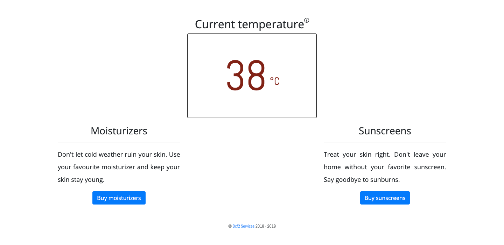

# Make me work!
Fix the issues in this repo and make this program work. This repository is aimed at folks who have already learnt to *write* basic Python but are looking for more realistic challenges that involve reading a large enough codebase, exploring file structures and making changes to an existing codebase. 

The code you are going to run is a Selenium test for the [Weather Shopper](http://weathershopper.pythonanywhere.com/) application. The automated test itself completes the [weather shopper exercise](https://github.com/qxf2/weather-shopper). Your job is to fix the problems in the automated test and make it run successfully. 

# Setup
0. This codebase uses Python 3.7.x 
1. Fork this repository
2. Clone your forked repository
3. Create a virtualenv and activate it
4. `pip install -r requirements.txt`
5. Install Chrome driver. If you don't know how to, please try:
   > [Chrome driver](https://sites.google.com/a/chromium.org/chromedriver/getting-started)
6. Run the test using the command `pytest -k e2e`

The setup instructions are intentionally high-level since this repository is aimed at people with people who have already written Python before. If you are beginner, you will find our [other repository](https://github.com/qxf2/wtfiswronghere) a better place to start. 

# Your assignment
The [weather shopper exercise](https://github.com/qxf2/weather-shopper) has been partially completed using the code provided to you. Your assignment is to:

1. fix the errors in the existing code 
2. complete the exercise on the payment page 
3. use the same design patterns and programming style when solving the exercises

# How to proceed?
1. Run the test using the command `pytest -k e2e`
2. Observe, debug and fix the error
3. Test your fix
4. Commit your change and push
5. Repeat steps 1-4 for the next error

# Example working test
If you fix all the bugs in this code, your test should perform like the gif below:

Remember, you should not stop at just fixing the existing code. You should also complete the instructions on the cart page too!

# Debugging tips
Here are some useful debugging tips that do not involve the use of debugger:

1. Search for strings in all files 
2. Search for sub-strings in all files if the exact string does not exist
3. F12 to follow the definition of a method in Visual Studio Code
4. Add debug messages to figure out the flow 
5. if True: trick (to get exact error messages, in the test, replace `try:` with `if True:` and comment out the `except` portion)
6. Read the log messages backwards 
7. Sometimes the error happens in the line before the failure!

# Notes
1. Use Python 3.7.x or higher
2. We recommend using Visual Studio code as your IDE
3. We recomment using a virtualenv
4. You need to have Chrome driver installed

# About
This repository is created and maintained by [Qxf2 Services](https://qxf2.com/?utm_source=github&utm_medium=click&utm_campaign=Make%20me%20word). Qxf2 provides software testing services for startups.
If your team is working on an early stage product and needs QA, you can hire Qxf2 Services to help. Contact Arun at mak@qxf2.com
